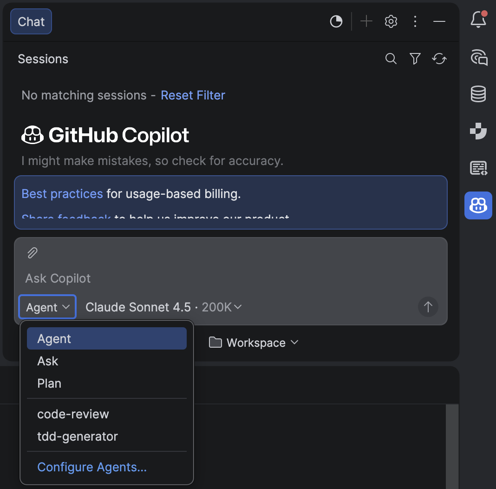

# GitHub Copilot Custom Agents for Java/Spring Boot

[](https://opensource.org/licenses/MIT)
[](https://github.com/sabirhussain/ai-code-assistance-agents/releases)

> **Supercharge your Java/Spring Boot development with custom GitHub Copilot agents**

This repository provides production-ready, token-optimized custom agents for GitHub Copilot CLI that specialize in
Test-Driven Development (TDD) and code review for Java/Spring Boot projects.

## 🚀 Quick Start

Install system-wide agents with a single command:

```bash
bash <(curl -fsSL https://raw.githubusercontent.com/sabirhussain/ai-code-assistance-agents/main/github-agent-install.sh)
```

That's it! The agents are now available across all your repositories.

## 🤖 Available Agents

### 🧪 TDD Generator

Generates comprehensive failing unit tests following TDD principles. Produces JUnit 5 + Mockito tests with mutation
testing configuration.

**Usage**: `gh copilot agent tdd-generator`

**Features**:

- ✅ RED phase only (generates failing tests, never implementation)
- ✅ AAA pattern (Arrange-Act-Assert)
- ✅ Automatic dependency inference
- ✅ PIT mutation testing integration
- ✅ Token-optimized (minimal context reads)

### 🔍 Code Review Agent

Performs intelligent code reviews focused on architecture, security, and testability for Java/Spring Boot code.

**Usage**: `gh copilot agent spring-boot-peer-review`

**Review Priorities**:

1. 🔴 **Security** - Credentials, secrets, vulnerabilities
2. 🟠 **Architecture** - SOLID violations, DI anti-patterns
3. 🟡 **Testability** - Hidden dependencies, static calls
4. 🟢 **Maintainability** - DRY, complexity, method size
5. 🔵 **Modernization** - JDK improvements, best practices

## 📦 What Gets Installed

```
~/.copilot/
├── agents/
│   ├── tdd-generator.agent.md
│   └── spring-boot-peer-review.agent.md
├── skills/
│   ├── write-failing-test/
│   └── code-review/
├── config/
│   └── copilot-config.yml
├── patterns/
│   ├── test-patterns.yml
│   └── review-patterns.yml
├── instructions/
│   └── copilot-instructions.md
└── USAGE.md
```

## 💡 Usage Examples

### Accessing Custom Agents

Select your custom agents from the Agent dropdown in GitHub Copilot CLI:



### Generate Tests for a New Feature

```bash
$ gh copilot agent tdd-generator

You: Generate tests for PaymentService that validates amounts,
     processes credit cards, and handles failures with retry logic

Agent: [Generates PaymentServiceTest.java with comprehensive test cases]
```

### Review Changed Files Before Commit

```bash
$ git status
  Modified: src/main/java/com/example/UserService.java

$ gh copilot agent spring-boot-peer-review

Agent: [Reviews file and reports security, architecture, and testability issues]
```

### Deep Architectural Review

```bash
$ gh copilot agent spring-boot-peer-review "deep review src/main/java/com/example/auth/"

Agent: [Performs cross-file analysis with dependency checking]
```

## ⚙️ Configuration

After installation, customize `~/.copilot/config/copilot-config.yml` for your projects:

```yaml
project:
  language: Java
  lang_version: 17
  build_tool: Maven

framework:
  spring_boot_version: 3.5.11

package:
  base: com.example.app
  test_path: src/test/java/com/example/app
  main_path: src/main/java/com/example/app

testing:
  framework: JUnit 5 + Mockito
  mutation_tool: PIT
  nested_test: true
  aaa_comments: true
```

**Per-Project Override**: Create `.github/copilot-config.yml` in any repository to override system defaults.

## 🔧 Installation Options

### Interactive Install (default)

```bash
bash <(curl -fsSL https://raw.githubusercontent.com/sabirhussain/ai-code-assistance-agents/main/github-agent-install.sh)
```

Prompts for configuration values with sensible defaults.

### Non-Interactive Install

```bash
bash <(curl -fsSL https://raw.githubusercontent.com/sabirhussain/ai-code-assistance-agents/main/github-agent-install.sh) -y
```

Uses all defaults for quick personal setup.

### Enterprise/Team Setup (Recommended for CI/CD)

For company-wide or team deployments:

1. **Fork this repository** to your organization
2. **Customize templates** in `.github/` directory:
    - Update `copilot-config.template.yml` with your company defaults
    - Modify `copilot-instructions.md.template` for your coding standards
    - Adjust pattern files for your tech stack
3. **Deploy to team**:
   ```bash
   bash <(curl -fsSL https://raw.githubusercontent.com/YOUR_ORG/ai-code-assistance-agents/main/github-agent-install.sh) -y
   ```

This ensures consistent configuration across your organization.

### Local Testing Mode (for developers)

```bash
# Run installer in local mode
./github-agent-install.sh --local
```

Tests installer with local files before pushing to GitHub. See [LOCAL_TESTING.md](local_testing.md) for details.

### Show Help

```bash
./github-agent-install.sh -h
```

## 🛡️ Safety Features

- ✅ **Automatic Backup**: Existing installations backed up to `~/.copilot.backup-TIMESTAMP/`
- ✅ **Idempotent**: Can run multiple times safely
- ✅ **Network Validation**: Tests GitHub connectivity before starting
- ✅ **Permission Checks**: Validates write permissions upfront
- ✅ **Graceful Failures**: Clear error messages with actionable steps

## 📚 Documentation

After installation, comprehensive documentation is available at `~/.copilot/USAGE.md`:

```bash
cat ~/.copilot/USAGE.md
```

**Includes**:

- Detailed agent descriptions and use cases
- Configuration guide with examples
- Troubleshooting common issues
- Update and uninstall instructions
- Quick reference card

## 🔄 Updating

Re-run the installer to update to the latest version:

```bash
bash <(curl -fsSL https://raw.githubusercontent.com/sabirhussain/ai-code-assistance-agents/main/github-agent-install.sh)
```

Your existing installation will be backed up automatically.

## 🗑️ Uninstalling

### Safe Uninstall (Recommended)

Removes only files installed by this project, preserves other custom agents/skills:

```bash
bash <(curl -fsSL https://raw.githubusercontent.com/sabirhussain/ai-code-assistance-agents/main/uninstall-github-agent.sh)
```

Or download and run locally:

```bash
curl -fsSL https://raw.githubusercontent.com/sabirhussain/ai-code-assistance-agents/main/uninstall-github-agent.sh -o uninstall-github-agent.sh
chmod +x uninstall-github-agent.sh
./uninstall-github-agent.sh
```

**What gets removed**:

- `tdd-generator` and `spring-boot-peer-review` agents
- Associated skills and configuration files
- Pattern files and instructions
- USAGE.md guide

**What's preserved**:

- Directory structure (`agents/`, `skills/`, etc.)
- Other custom agents or skills you may have
- Your custom configurations

### Restore From Backup

```bash
ls -d ~/.copilot.backup-*
cp -R ~/.copilot.backup-20260722-143000 ~/.copilot
```

## 🎯 Key Features

### Token Economy Optimized

All agents implement aggressive token optimization:

- Configuration values cached for session duration
- Progressive disclosure (ask only required fields)
- Maximum 3 context file reads unless explicitly needed
- No semantic search unless user explicitly requests it

### TDD-First Philosophy

The TDD Generator strictly follows RED phase only:

- Never creates implementation classes
- Never modifies build files (provides snippets as reference)
- Tests fail because implementation doesn't exist (this is correct!)

### Intelligent Code Review

The Code Review agent uses a priority-based approach:

- **Targeted Review** (default): Only review explicitly requested or changed files
- **Deep Review** (on request): Analyze dependencies and architectural impact
- Never reports style issues or formatting nitpicks
- Only surfaces genuinely important problems

## 📋 Requirements

- **GitHub Copilot CLI** installed and configured
- **curl** for downloading installer
- **Bash** (macOS, Linux, WSL, Git Bash)
- Internet connection to GitHub

## 🤝 Contributing

Contributions are welcome! Please feel free to submit issues or pull requests.

### Development Setup

1. Clone the repository:
   ```bash
   git clone https://github.com/sabirhussain/ai-code-assistance-agents.git
   cd ai-code-assistance-agents
   ```

2. Test installer locally:
   ```bash
   bash github-agent-install.sh
   ```

3. Make changes to templates in `.github/`

4. Test with a fresh install

## 🐛 Troubleshooting

### Agent Not Found

```bash
# Verify installation
ls ~/.copilot/agents/

# Re-run installer if needed
bash <(curl -fsSL https://raw.githubusercontent.com/sabirhussain/ai-code-assistance-agents/main/github-agent-install.sh)
```

### Configuration Not Applied

```bash
# Check for template placeholders
grep -r "{{" ~/.copilot/

# If found, re-run installer
bash <(curl -fsSL https://raw.githubusercontent.com/sabirhussain/ai-code-assistance-agents/main/github-agent-install.sh) -y
```

### Network Errors

```bash
# Test GitHub connectivity
curl -I https://github.com

# Try with timeout
timeout 300 bash <(curl -fsSL https://raw.githubusercontent.com/sabirhussain/ai-code-assistance-agents/main/github-agent-install.sh)
```

See `~/.copilot/USAGE.md` for comprehensive troubleshooting guide.

## 📝 License

MIT License - see [LICENSE](LICENSE) for details.

## 🌟 Show Your Support

If you find these agents useful, please consider:

- ⭐ Starring this repository
- 🐛 Reporting issues you encounter
- 💡 Suggesting new features or improvements
- 🤝 Contributing code or documentation

## 📞 Support

- **Issues**: https://github.com/sabirhussain/ai-code-assistance-agents/issues
- **Discussions**: https://github.com/sabirhussain/ai-code-assistance-agents/discussions

---

**Made with ❤️ for the Java/Spring Boot community**

*Enhance your development workflow with AI-powered TDD and code review!*
